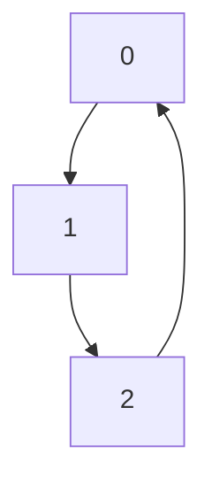
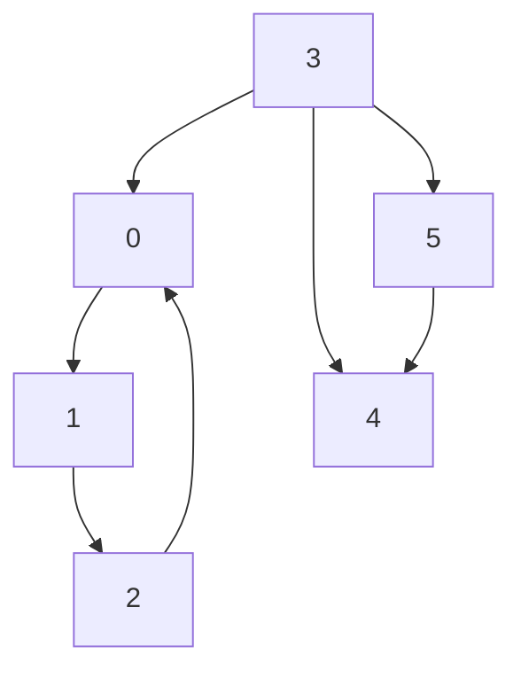

# Giraffe 🦒 

Experimental graphing library in go

> a list of what is implemented so far :-

- Search
    - Breadth-First
    - Depth-First
- Sorting (Siblings, Nodes)
- Centrality
    - Degree
    - Betweenness
- Clustering
    - K-Means
- Exporters
    - Export to [Mermaid](https://mermaid.js.org/)
    - Export to [Graphviz Dot](https://graphviz.org)

- [What is a graphing library?](#What-is-a-graphing-library?)
- [Examples](#examples)
  - [Depth-first search](#A-Depth-first-search)
  - [Get various centralities for the graph](#Get-various-centralities-for-the-graph)
  - [K-Means Clustering](#k-means-clustering)
  - [Export to various formats](#export-to-various-formats)
    
> [!NOTE]
> I haven't used this library for serious experimentations with actual graph data. A lot of this is
> purely through intuition, eg - this is how it's supposed to work if I understand it correctly.

## Usage

### Simplest representation of a graph

```go
package main 

import (
    "github.com/aadv1k/giraffe"
    "fmt"
)

func main() {
    var g giraffe.Graph

    g.AddVertex(&giraffe.Vertex{ Index: 0 })
    g.AddVertex(&giraffe.Vertex{ Index: 1 })
    g.AddVertex(&giraffe.Vertex{ Index: 2 })

    g.AddEdge(&giraffe.Edge{Start: g.GetVertex(0), End: g.GetVertex(1)})
    g.AddEdge(&giraffe.Edge{Start: g.GetVertex(1), End: g.GetVertex(2)})
    g.AddEdge(&giraffe.Edge{Start: g.GetVertex(2), End: g.GetVertex(0)})
    
    fmt.Print(g.ParseToMermaid())
}
```



## What is a graphing library?

Graphing library implement a host of functions that interact with a data structure called a graph. A
graph consists of `Vertices` and `Edges`, the latter defines how one `Vertex` relates to other. 

Mature libraries such as [NetworkX](https://networkx.org/), often deal with graphs spanning over a
million vertices with amazing efficiency and speed.

This is not such library. It is primarily built as an exploratory/research project to probe this
paradign of computation

## Examples

### A Depth-first search 

```go
package main

import (
	"github.com/aadv1k/giraffe"
)

func main() {
	var g *giraffe.Graph
	g = giraffe.MakePyramidGraph() // Utility function to generate a sample graph

	// Visit the vertices using Depth-First Search
	_, visited := g.FindVertexDFS(3)

	giraffe.PrintVertices(visited) // Utility function to print the vertex array
}
```

```
{ 0, 2, 5, 4, 3 }
```

Additionally, you can also do the same using Breadth-First Search

```go
    // ... 

    _, visited := g.FindVertexBFS(0, 3)

    // ...
```

```
{ 0, 1, 2, 3 }
```

### Get various centralities for the graph

```go
func main() {
	var g *giraffe.Graph
	g = giraffe.MakePyramidGraph() // Utility function to generate a sample graph

	fmt.Printf("Degree: %v\n", g.GetDegree())
	fmt.Printf("Betweenness: %v\n", g.GetBetweenness())
}
```

```
Degree: [0 1 1 1 1 2]
Betweenness: [1 1 1 1 1 1]
```

### K-Means Clustering

```go
func main() {
	var g *giraffe.Graph
	g = giraffe.MakeClusterGraph() // Utility function to generate a sample graph

	clusters, means := g.KMeansClustering(2)

	fmt.Printf("%v\n", means)
	fmt.Printf("There are %d clusters", len(clusters))
}
```

```
[1.472636459754717 1.0380631836067153]
There are 2 clusters
```


### Export to various formats

The library doesn't come with any dependency, instead it can spit out DSL code that can allow you to
render the graph in other libs. Eg

```go
func main() {
	var g *giraffe.Graph
	g = giraffe.MakeClusterGraph()

	fmt.Print(g.ParseToMermaid())
}
```



or [Graphviz](https://graphviz.org)

```go
func main() {
	var g *giraffe.Graph
	g = giraffe.MakeClusterGraph()

	fmt.Print(g.ParseToGraphvizDot())
}
```
```
digraph G {
    0;
    1;
    2;
    3;
    4;
    5;
    0 -> 1;
    1 -> 2;
    2 -> 0;
    3 -> 0;
    3 -> 4;
    3 -> 5;
    5 -> 4;
}
```


and that's it for now! these functions describe the upper and lower-bound of this experimental
library.
