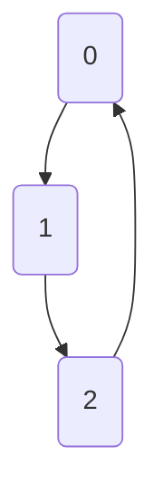

# Giraffe 🦒 

Experimental graphing library in go

a list of what is implemented so far (these are not USPs, but simply a visual tracker for the features)

- Search
    - Breadth-First
    - Depth-First
- Sorting (Siblings, Nodes)
    - Selection Sort 
    - **TBD**
- Centrality (based on)
    - Degree
    - Betweenness
- Clustering
    - **TBD**

## Usage

### Simplest representation of a graph

```go
package main 

import (
    "github.com/aadv1k/giraffe"
)

func main() {
    var g giraffe.Graph

    g.AddVertex(&giraffe.Vertex{ Index: 0 })
    g.AddVertex(&giraffe.Vertex{ Index: 1 })
    g.AddVertex(&giraffe.Vertex{ Index: 2 })

    g.AddEdge(&giraffe.Edge{Start: g.GetVertex(0), End: g.GetVertex(1)}})
    g.AddEdge(&giraffe.Edge{Start: g.GetVertex(1), End: g.GetVertex(2)}})
    g.AddEdge(&giraffe.Edge{Start: g.GetVertex(2), End: g.GetVertex(0)}})
}
```



## What is a graphing library?

Graphing library implement a host of functions that interact with a data structure called a graph. A
graph consists of `Vertices` and `Edges`, the latter defines how one `Vertex` relates to other. 

Mature libraries such as [NetworkX](https://networkx.org/), often deal with graphs spanning over a
million vertices with amazing efficiency and speed.

This is not such library. It is primarily built as an exploratory/research project to probe this
paradign of computation

## Example

> Taken from [./examples/main.go](./examples/main.go)

Do a Breadth-First search and print all the vertices that were visited.

```go
func main() {
    var g giraffe.Graph

    v0 := &giraffe.Vertex{Index: 0}
    v1 := &giraffe.Vertex{Index: 1}

    g.AddVertex(v0)
    g.AddVertex(v1)

    g.AddEdge(&giraffe.Edge{Start: v0, End: v1})
    
    // Find the provided index using Breadth-First Search 
    found, visited := g.FindVertex(1)

    fmt.Printf("Found: %d\n", found.Index)

    // Returns an array of visited vertices
    fmt.Print("Visited: { ")
    for i, vtx := range visited {
			if i == len(visited) - 1 {
				fmt.Printf("%d }\n", vtx.Index)
				continue
			}
      fmt.Printf("%d, ", vtx.Index)
    }
}
```
